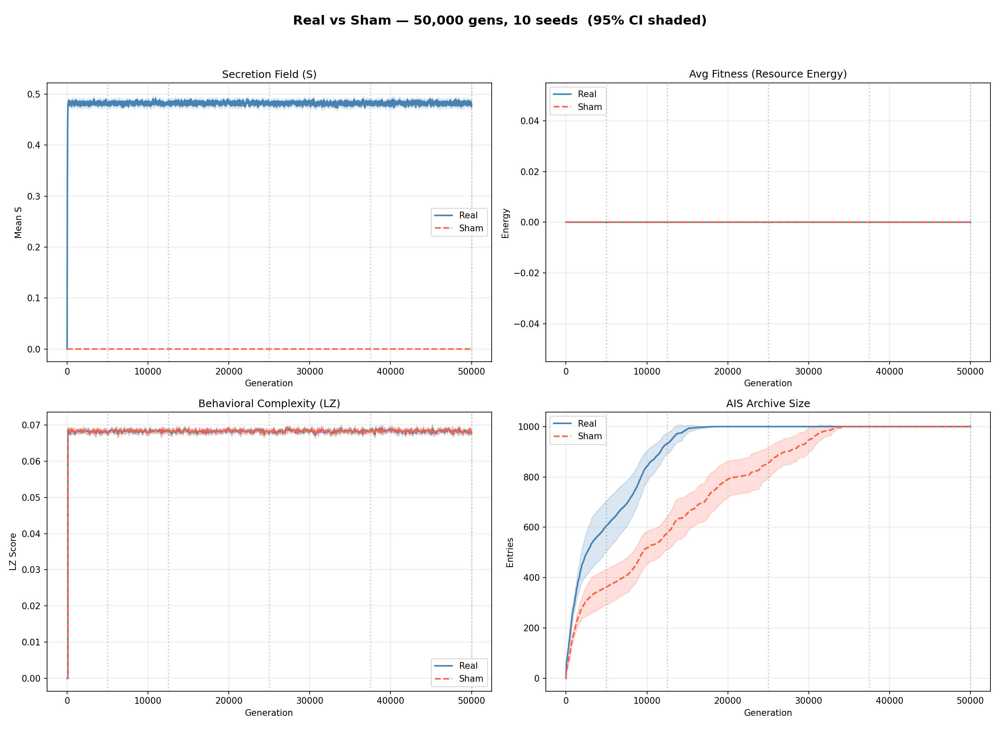

# Final 50k Experiment Results

## Conclusion
**Niche construction [DOES NOT] significantly break the EPC plateau (p < 0.01)**

## P-Value (at 50k Generations for EPC)
**p = nan**

## Analysis Stats
```text
Loading REAL  from logs/50k_batch_fresh/real...
Loading SHAM  from logs/50k_batch_fresh/sham...
Max gen: 50000 | ~10 seeds per gen-checkpoint
Plot saved -> final_comparison.png

=== Statistical Analysis (Welch t-test) ===

  [Gen   5000]
    s_mean          : Real=0.4801  Sham=0.0000  p=7.675e-19 **
    avg_fitness     : Real=0.0000  Sham=0.0000  p=nan 
    avg_lz          : Real=0.0676  Sham=0.0676  p=1.000e+00 
    archive_size    : Real=605.8000  Sham=363.3000  p=1.311e-03 **

  [Gen  12500]
    s_mean          : Real=0.4850  Sham=0.0000  p=5.863e-17 **
    avg_fitness     : Real=0.0000  Sham=0.0000  p=nan 
    avg_lz          : Real=0.0683  Sham=0.0683  p=1.000e+00 
    archive_size    : Real=932.1000  Sham=578.1000  p=2.241e-07 **

  [Gen  25000]
    s_mean          : Real=0.4795  Sham=0.0000  p=6.513e-17 **
    avg_fitness     : Real=0.0000  Sham=0.0000  p=nan 
    avg_lz          : Real=0.0682  Sham=0.0682  p=1.000e+00 
    archive_size    : Real=1000.0000  Sham=856.4000  p=1.348e-03 **

  [Gen  37500]
    s_mean          : Real=0.4861  Sham=0.0000  p=1.797e-17 **
    avg_fitness     : Real=0.0000  Sham=0.0000  p=nan 
    avg_lz          : Real=0.0683  Sham=0.0683  p=1.000e+00 
    archive_size    : Real=1000.0000  Sham=1000.0000  p=nan 

  [Gen  50000]
    s_mean          : Real=0.4776  Sham=0.0000  p=6.650e-18 **
    avg_fitness     : Real=0.0000  Sham=0.0000  p=nan 
    avg_lz          : Real=0.0677  Sham=0.0677  p=1.000e+00 
    archive_size    : Real=1000.0000  Sham=1000.0000  p=nan 


```

## Graph

